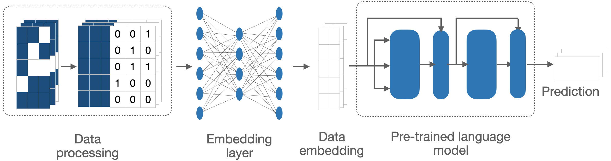

# PRIME-LLM analysis code

This repository contains the code used to reproduce experiments described in [**"Leveraging pretrained large language model for prognosis of type 2 diabetes with longitudinal medical records"**](https://www.medrxiv.org/content/10.1101/2025.02.04.24313200v1). Please follow the steps below to run the analysis and the machine learning framework for similar health data. 

## Data
The data used in this manuscript was obtained from the Diabetes-Patienten-Verlaufsdokumentation (DPV), an initiative to enhance diabetes research and treatment. For more information about the project and data acquitition please visit: https://buster.zibmt.uni-ulm.de/.

Please clone this repository and obtain the data to your local computer. 

## Install conda environment
First install conda if you have not done that. Then within this repos directory install and activate the conda environment using:

```sh
conda env create -f prime_llm_environment.yml
conda activate PRIME_LLM
```

## Preprocess raw data
The raw data obtained from DPV was a `.csv` file with columns representing clinical variables and rows representing clinic visits grouped by patients. The preprocessing of the raw data was performed using the script `DPV_preprocessing/preprocess.py`, which outputs a list of numpy arrays, one for each patient timeline. This is specific for the DPV data, for other datasets please have a customized preprocessing. 

## Make input for PRIME-LLM
First we need to standardise and rearrange the data columns. The input is the preprocessed data list from previous step, the column names for numeric and discrete features, as well as their corresponding missing mask. We also need the indices of the target-related columns (to remove them). Specify all the necessary information in `configs/standardise_and_rearrange_data.yml` and run: 

```sh
python3 scripts/standardise_and_rearrange_data.py --config configs/standardise_and_rearrange_data.yml
```

We then make the ready input for PRIME-LLM. Using the output from the above step and specify all the necessary information in `configs/make_input.yml`, then run:

```sh
python3 scripts/make_input.py --config configs/make_input.yml
```

We now have a nice 3D tensor of shape (sample size, max sequence length, feature size) as input. 

## Generate synthetic data
Due to specific circumstances we needed to generate synthetic data from the original DPV data, and used both datasets in parallel throughout the analysis. Here we implemented the variational autoencoder on top of the long short term memory modeling (LSTM-VAE) to robustly preserving the original data distribution and the autoregressive data structure while introducing enough noise to make new data. 

To generate synthetic data, simply edit the `generate_synthetic_data/config.yml` file and then run the following script:

```sh
python3 generate_synthetic_data/run_lstm_vae.py --config generate_synthetic_data/config.yml
```

## Make prediction leveraging pretrained large language models
Medical time series data is notably very sparse with a lot of missing information. Futhermore, high number of features complicates the analyses. In order to leverage the prediction power of pretrained large language models in the most efficient way, I introduce a novel data processing and embedding method to bridge the gap between the two domains. Details of the method could be found in the [manuscript](https://www.medrxiv.org/content/10.1101/2025.02.04.24313200v1). In short, missing information is summarized as a missing mask which is appended to the training data as additional features, as performed in the previous step. In addition, a learnable embedding layer is prepended to the pretrained LLM to adapt the numeric data to the LLM architecture. Both components are learned simultaneously during training. 



To run the framework, just modify the `configs/run_prime_llm.yml` file to set the parameters for the model, then run the following command:

```sh
python3 scripts/run_prime_llm.py --config configs/run_prime_llm.yml
```

### Cross-validation
In the manuscript we did several benchmarking by cross-validation. To run the cross-validation, please set the neccessary parameters by adjusting the corresponding YML files `configs/cv_*.yml`.

For example, to benchmark the performance of PRIME-LLM and transformer at different training sizes, run the following commands, respectively:

```sh
python3 scripts/cv_prime_llm_trainSize.py --config configs/cv_prime_llm_trainSize.yml
python3 scripts/cv_transformer_trainSize.py --config configs/cv_transformer_trainSize.yml
```

If we want to compare the performance of PRIME-LLM versus XGBoost, at different horizons, run the following commands, respectively:

```sh
python3 scripts/cv_prime_llm_slidWindow.py --config configs/cv_prime_llm_SlidWindow.yml
python3 scripts/cv_xgb_slidWindow.py --config configs/cv_xgb_slidWindow.yml
```

## Model interpretation
Integrated gradients help attribute the prediction to the input features, providing insights into which features are most important for the model's decision. To run the script, modify the `configs/get_integrated_gradient.yml` file to set the parameters for the trained model, data, and results directory, then run the following command:

```sh
python scripts/get_integrated_gradient.py --config configs/get_integrated_gradient.yml
```

## Citation

If you use this repository or the methods in your work, please cite the accompanying paper:

Nguyen BP, et al. "Leveraging pretrained large language model for prognosis of type 2 diabetes with longitudinal medical records." medRxiv 2025. DOI: 10.1101/2025.02.04.24313200. URL: https://www.medrxiv.org/content/10.1101/2025.02.04.24313200v1

BibTeX:
@article{nguyen2025leveraging,
  author = {Nguyen, Bahung Phong and others},
  title = {Leveraging pretrained large language model for prognosis of type 2 diabetes with longitudinal medical records},
  journal = {medRxiv},
  year = {2025},
  doi = {10.1101/2025.02.04.24313200},
  url = {https://www.medrxiv.org/content/10.1101/2025.02.04.24313200v1}
}

## Contact
If you have any question regarding the method and the code, you can reach me via phong.nbh@gmail.com. 